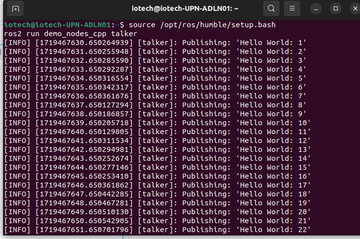
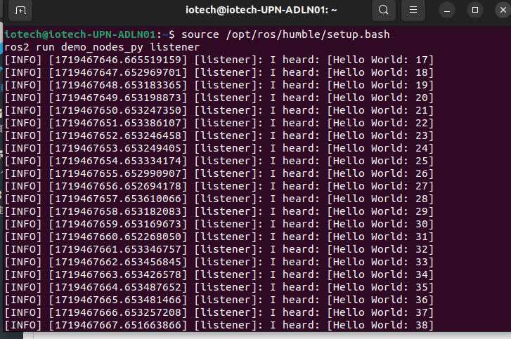

# Installing ROS2
### add ROS2 apt repository
> [!NOTE]
> apt(Advanced Packaging Tool):用於安裝、更新或刪除
> 
> repository :儲存庫

### ensure that the *Ubunto Universe repository* (This repository is community maintained and it provides free and open-source software.) is enable
```
sudo apt install software-properties-common
sudo add-apt-repository universe
```

### Add ROS2 GPG key with apt
```
sudo apt update && sudo apt install curl -y
sudo curl -sSL https://raw.githubusercontent.com/ros/rosdistro/master/ros.key -o /usr/share/keyrings/ros-archive-keyring.gpg
```
從ROS2的網址上下載KEY，並存在...的路徑中。

### then add the repository to your sources list.
```
echo "deb [arch=$(dpkg --print-architecture) signed-by=/usr/share/keyrings/ros-archive-keyring.gpg] http://packages.ros.org/ros2/ubuntu $(. /etc/os-release && echo $UBUNTU_CODENAME) main" | sudo tee /etc/apt/sources.list.d/ros2.list > /dev/null
```
在Ubuntu 系統上設定 ROS 2 的軟體庫，讓系統知道去哪裡找尋 ROS2 相關的軟體包和更新。

### update apt repository caches
```
sudo apt update
sudo apt upgrade
```
ROS2 packages are frequently updated on Ubuntu.
### Desktop install
```
sudo apt install ros-humble-desktop
```

### ROS-Base Install (Bare Bones): Communication libraries, message packages, command line tools. No GUI tools.
```
sudo apt install ros-humble-ros-base
```

### Development tools: Compilers and other tools to build ROS packages
```
sudo apt install ros-dev-tools
```

# Try example
### open one terminal, source the setup file and run a `talker`(C++):
```
source /opt/ros/humble/setup.bash
ros2 run demo_nodes_cpp talker
```
### Open another terminal, and source the setup file and then run `lestener`(python):
```
source /opt/ros/humble/setup.bash
ros2 run demo_nodes_py listener
```

And the result will be shown like below





